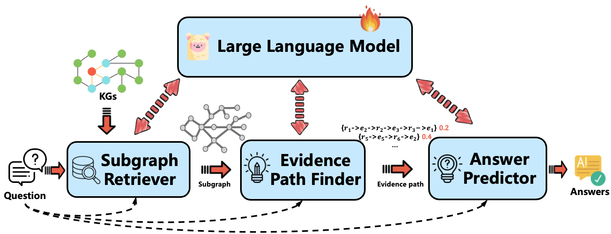

# An evidence path enhanced reasoning model for knowledge graph question and answering
This is the official implementation code of the EPERM algorithm,[Eperm: An evidence path enhanced reasoning model for knowledge graph question and answering]



## Requirements
1、Hardware Requirements: An NVIDIA GPU environment is required, with CUDA version 12.4 or higher and driver version 550 or above. Additionally, this project involves fine‑tuning. VRAM consumption depends on the size of the language model being fine‑tuned.
For a 7B model, it is recommended to use an 8‑card A40 48G or 8‑card L20 48G server.
2、Install the required environment dependencies by running:
``` 
pip install -r requirements.txt
```
3、Dataset configuration details can be found in /datasets.

## Model Training
The default model used here is LLama2‑7B. If you switch to another model, you may need to adjust the corresponding prompt template.

### Training Dataset Construction
1、Build SFT datasets for questions and planning sequences:
```bash
python src/planning/build_planning_dataset.py
```
2、Preprocess datasets for planning sequences and corresponding answers:
```bash
python src/joint_training/preprocess_plan.py
python src/joint_training/preprocess_qa.py
```


## Inference
### Step1:Generate Relation Sequences for Questions
Run: `./scripts/planning.sh`

```bash
python src/qa_prediction/gen_rule_path.py \
        --model_name EPERM \
        --model_path longxiao/EPERM \
        -d {EPERM-webqsp,EPERM-cwq} \
        --split test \
        --n_beam 3
```

### Step2: Perform Reasoning and Generate Answers
Run: `./scripts/my_reasoning.sh`
```bash
python src/qa_prediction/predict_answer.py \
        --model_name RoG \
        --model_path longxiao/EPERM \
        -d {RoG-webqsp,RoG-cwq} \
        --prompt_path prompts/llama2_predict.txt \
        --add_rul \
        --rule_path {rule_path} \
```
